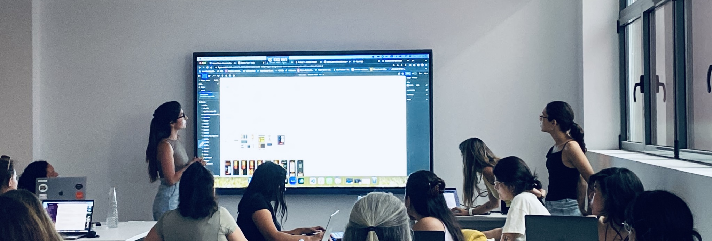

# 
 Hi there 👋 I'm Lea 

## 
 Full-Stack Developer 

 🔭 I am always looking to be challenged and to challenge others.

 🌱 I think that I can define myself as a person who constantly reinvents herself.
That's why I am currently a Full-Stack Developer student, and I feel proud to be part of this very
interesting new world.

I worked as a doctor before, which allowed me to develop assertive communication and learn to work as a team, as well as to maintain a critical and positive attitude in the face of difficulties and failure.

What excites me the most in this field, is the endless possibilities and the opportunity to continuously learn and grow. 

### Connect with me 

###  Languages and Tools

 
  
  

   

</td><td valign="top" width="33%">

 

 
 

</td><td valign="top" width="33%">

